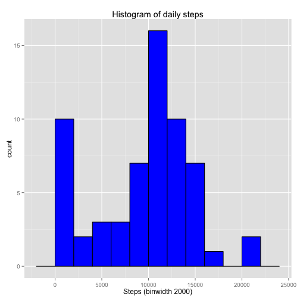
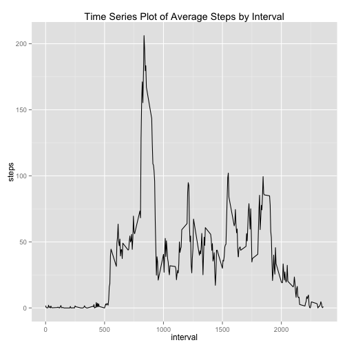
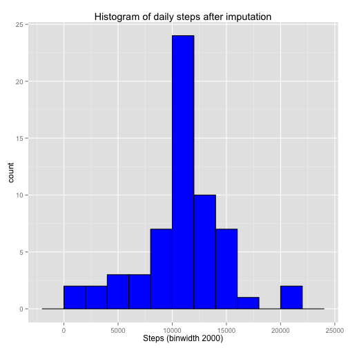
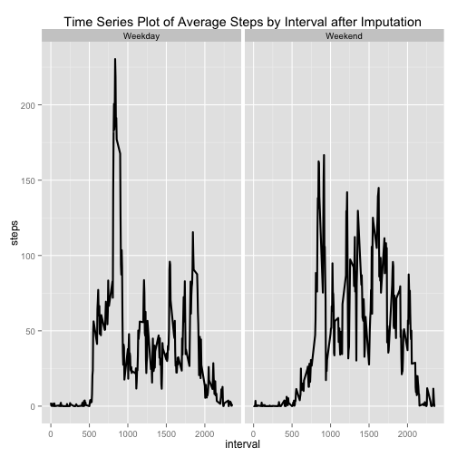

## Loading and preprocessing the data


```r
#Load the data 
df <- read.csv("activity.csv")
#Process/transform the data (if necessary) into a format suitable for your analysis
df$date <- as.Date(df$date)
```

## What is mean total number of steps taken per day?


```r
#Make a histogram of the total number of steps taken each day
library(ggplot2)
stepsbyday <- aggregate(x = df$steps , by = list(df$date), FUN = sum ,na.rm=TRUE)
names(stepsbyday) <- c("date","steps")
plot <- ggplot(stepsbyday,aes(x = steps)) +
        ggtitle("Histogram of daily steps") +
        xlab("Steps (binwidth 2000)") +
        geom_histogram(binwidth = 2000, col="black",fill="blue")
plot
```

 


```r
#mean total number of steps taken per day
mean(stepsbyday$steps, na.rm = TRUE)
```

```
## [1] 9354.23
```


```r
#median total number of steps taken per day
median(stepsbyday$steps , na.rm = TRUE)
```

```
## [1] 10395
```


Mean total number of steps taken per day is 9354.2295082 <br>
Median total number of steps taken per day is 10395

## What is the average daily activity pattern?


```r
#Time series plot of the 5-minute interval and the average number of steps taken, averaged across all days 
averagestepsinterval  <- aggregate(x = df$steps , by = list(df$interval), FUN = mean ,na.rm=TRUE)
names(averagestepsinterval) <- c("interval","steps")
avgstepline <- ggplot(averagestepsinterval,aes(interval,steps)) +
               ggtitle("Time Series Plot of Average Steps by Interval") +
               geom_line()
avgstepline 
```

 


```r
#The 5-min time interval contains the maximum number of steps?
averagestepsinterval[which.max(averagestepsinterval$steps),c("interval")]
```

```
## [1] 835
```


The 5-min time interval contains the maximum number of steps is 835

## Imputing missing values


```r
#total number of missing values in the dataset
nrow(df[is.na(df$steps),])
```

```
## [1] 2304
```

```r
#imputing missing step values with mean step at time interval
df.imputed <- merge(x = df, y = averagestepsinterval, by = "interval", all.x = TRUE)
df.imputed[is.na(df.imputed$steps.x),c("steps.x")] <- df.imputed[is.na(df.imputed$steps.x),c("steps.y")]

#cleaning data
df.imputed$date <- as.Date(df.imputed$date)
df.imputed$date.x <- NULL
df.imputed$Group.1 <- NULL
df.imputed$steps <- df.imputed$steps.x
df.imputed$steps.x <- NULL
df.imputed$steps.y <- NULL

#histogram with new dataframe
totalstepsday <- aggregate(x = df.imputed$steps , by = list(df.imputed$date), FUN = sum ,na.rm=TRUE)
names(totalstepsday) <- c("date","steps")
histplot <- ggplot(totalstepsday,aes(x = steps)) +
            ggtitle("Histogram of daily steps after imputation") +
            xlab("Steps (binwidth 2000)") +
            geom_histogram(binwidth = 2000, col="black", fill="blue")
histplot 
```

 


```r
#mean total number of steps taken per day
mean(totalstepsday$steps , na.rm = TRUE)
```

```
## [1] 10766.19
```


```r
#median total number of steps taken per day
median(totalstepsday$steps , na.rm = TRUE)
```

```
## [1] 10766.19
```


New mean total number of steps taken per day is 1.0766189 &times; 10<sup>4</sup>  <br>
New median total number of steps taken per day is 1.0766189 &times; 10<sup>4</sup>


## Are there differences in activity patterns between weekdays and weekends?


```r
#Factor variable with two levels indicating a weekday or weekend.
df.imputed$weekday <- as.factor(ifelse(weekdays(df.imputed$date) %in% c("Saturday","Sunday"), "Weekend", "Weekday")) 
avgstepsintervalweekday  <- aggregate(x = df.imputed$steps , by = list(df.imputed$interval,df.imputed$weekday), FUN = mean ,na.rm=TRUE)
names(avgstepsintervalweekday) <- c("interval","weekday","steps")

#panel time series plot of the 5-minute interval and the average number of steps taken 
#averaged across all weekday days or weekend days.
avgstepline <- ggplot(avgstepsintervalweekday,aes(interval,steps)) +
               ggtitle("Time Series Plot of Average Steps by Interval after Imputation") +
               facet_grid(. ~ weekday) +
              geom_line(size = 1)
avgstepline  
```

 

